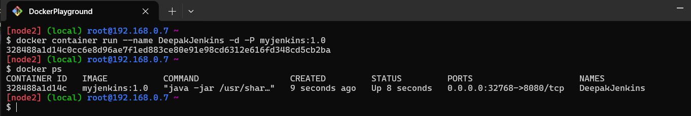

# Jenkins on Docker Playground

This project demonstrates building a Jenkins Docker image, running it in a container on Docker Playground, and using Jenkins to run a sample application.

## Prerequisites

- Access to [Docker Playground](https://labs.play-with-docker.com/).
- Basic understanding of Docker commands.

---

## Steps to Run the Project

### 1. Set Up Docker Playground
1. Visit [Docker Playground](https://labs.play-with-docker.com/).
2. Create a new instance and ensure Docker is installed and running.


### 2. Create the Dockerfile
1. Open a terminal in Docker Playground.
2. Connect to the instance from local gitbash terminal 

   


3. Create a file named `Dockerfile` with the following 

    ```dockerfile
    FROM ubuntu:24.04
    LABEL Author="Deepak Vakkala"
    USER root
    RUN apt update
    RUN apt install openjdk-17-jdk -y
    RUN apt install wget -y
    RUN wget -O /usr/share/keyrings/jenkins-keyring.asc  https://pkg.jenkins.io/debian/jenkins.io-2023.key && \
    echo "deb [signed-by=/usr/share/keyrings/jenkins-keyring.asc]"  https://pkg.jenkins.io/debian binary/ |  tee  /etc/apt/sources.list.d/jenkins.list > /dev/null
    RUN apt-get update && apt-get install jenkins -y
    EXPOSE 8080
    CMD ["java", "-jar", "/usr/share/java/jenkins.war"]
    ```

3. Save the file.

### 3. Build the Jenkins Docker Image
1. Run the following command to build the image:
    ```bash
    docker image build -t myjenkins:1.0 .
    ```
2. Verify the image creation:
    ```bash
    docker image ls
    ```

    


### 4. Run the Jenkins Container
1. Create and start a container in detached mode:
    ```bash
    docker container run --name DeepakJenkins -d -P myjenkins:1.0 
    ```
2. Verify the container is running:
    ```bash
    docker ps
    ```
   

3. click on 32768 port on Docker playground as shown in the picture for accessing application.


4. Now we can access Jenkins Application from web browser.


### 5. Retrieve Jenkins Admin Credentials
1. Access the container to get the initial admin password:
    ```bash
    docker exec -it DeepakJenkins /bin/bash
    cat /root/.jenkins/secrets/initialAdminPassword
    ```
2. Copy the password and save it for later.


### 6. Access Jenkins
1. Open your browser and go to `http://<your-docker-instance-ip>:8080`.
2. Paste the admin password to unlock Jenkins.
3. Complete the setup wizard and install the recommended plugins.

Follow steps for further usage of ***Jenkins*** see in the last steps

[Click Here](https://github.com/DeepakVakkalaDevOpsMutliCloud/Jenkins/blob/main/InstallJenkins/Jenkins.md)


## Conclusion

- This project helps you understand how to build and run Jenkins in Docker, retrieve credentials, and configure it use Jenkins application. 
- For further exploration, you can integrate Jenkins with other tools like GitHub, Docker Hub, or Kubernetes.